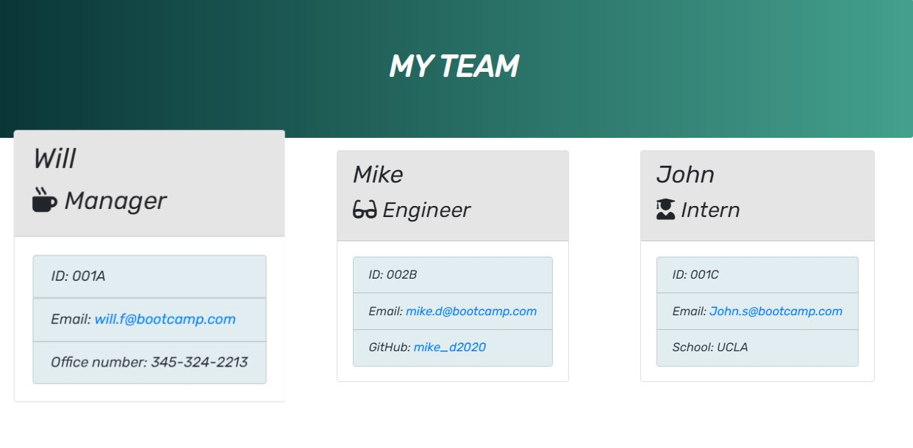

# 🏆 Team Profile Generator 🏆

##### **Badge:**

## **Description:**
* This app will help businesses by creating a list of all employees within its own teams. This app requests contact information from manager, engineers and interns.

## **Table of Contents:**
1. [Installation](#installation)
2. [Usage](#usage)
3. [Test](#test)
4. [Link](#link)
5. [Screenshots](#screenshots)

## **Installation:**
* The app is run via command line with npm dependencies such as `inquirer` and `jest`. Also the app will be tested by running 'npm run test'

## **Usage:**
* Account and request information to each member of a team.

## **Test:**
* Please key `npm run test` to verify app works as suppose to. 

## **Link:**
* [GitHub] - https://github.com/williamsffc

## **Screenshots:**

-------------
ReadMe was created using my own ReadMe Generator app
© Copyright - 2020

